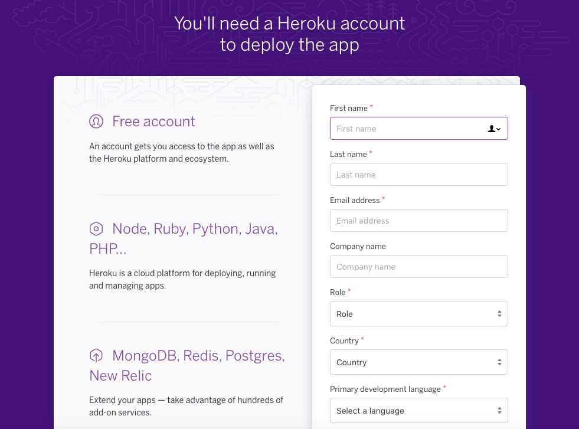
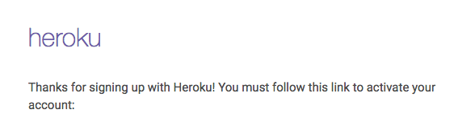
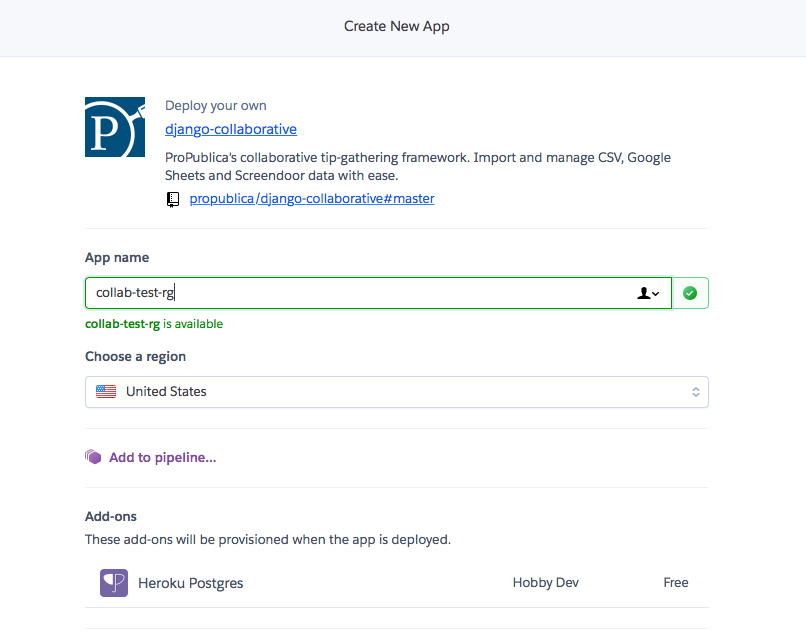
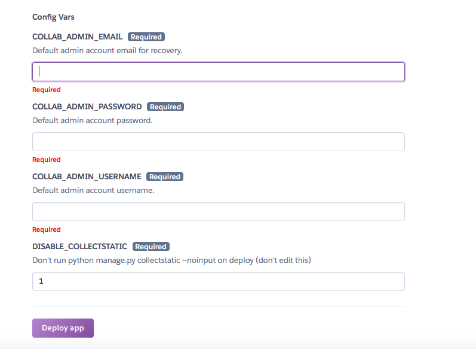
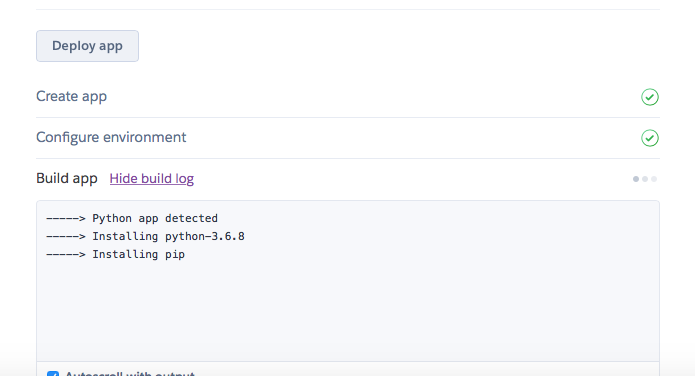
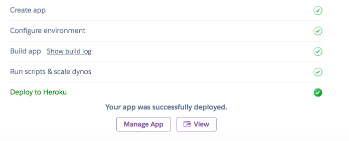
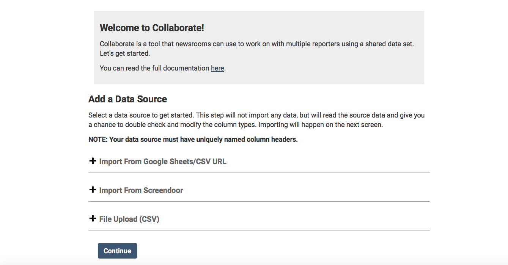

# How to Launch Collaborate \(using Heroku\)

1. [Click this link](https://heroku.com/deploy?template=https://github.com/propublica/django-collaborative/tree/master) to create a new instance of Collaborate in a service called Heroku. 
2. You'll need a Heroku account. Create a new account, or log into an existing one. Make sure you confirm your new account by email. Note that Heroku has free and paid tiers.

3. Under app name, choose a name. If it’s already in use, you'll get a message in red and have to choose another.

4. Scroll down — don't worry about pipeline or add-ons. Enter your email address under COLLAB\_ADMIN\_EMAIL. Create a password under COLLAB\_ADMIN\_PASSWORD, which you will use to log into Collaborate. Pick a secure one! Finally, enter a username under COLLAB\_ADMIN\_USERNAME. You’ll use this later to log into Collaborate. There's a final box labeled DISABLE\_COLLECTSTATIC; leave it as is.

5. Click “Deploy app.” The Heroku service will start running a script; wait for it to load. 

6. When the script finishes loading, at the bottom of the page, a message will appear: “Your app was successfully deployed.” Click on “View.”

7. You'll arrive on the app screen. Enter the username and password you just entered on the previous screen in Heroku.

That’s it! You’re now ready to create your first collaborative project.

Some important things to keep in mind.

1. You’ve created a copy of the Collaborate service that is for your exclusive use. Nobody has access to it but you. Later, we’ll show you how to add other users to your system.
2. You’ve created a website on the live internet. Although it will only accept secure connections from web browsers, it’s up to you to control access and to pick a good password to keep it secure.

