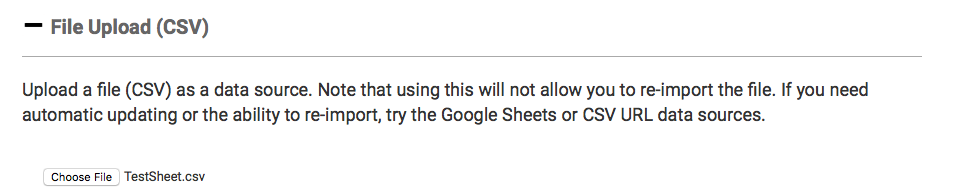

# Using a CSV File

Only use this option if your dataset is complete; this is a static file and won't auto-update. Just choose the file and upload it from your computer. It will use the file name that's saved on your computer.

In the “Add a Data Source” section, click on the plus sign to the left of “File Upload \(CSV\).”

