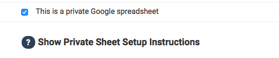
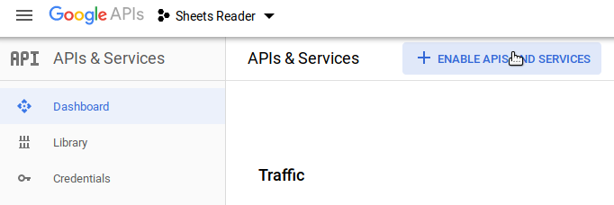

# Using a Private Google Spreadsheet

Important: Be sure that your data is in the first tab of the workbook.

You'll need to go through a short setup process the first time you add a private sheet. There’s a wizard with these instructions within Collaborate.

If your data contains sensitive information or information you’re not ready to be public, Collaborate does support using private Google Sheets. The process is a little involved but actually very easy.

Importing private Google Sheets for the first time consists of several steps: creating a Google service account that can access Google Sheets, uploading an account credentials file to your version of Collaborate and sharing the sheet with the account email.

### Creating a Service Account and Credentials File

A service account is a special kind of account you create with which you can later share your spreadsheet in a secure way. It may look like an email address, but it won’t work as one. You only need to create a service account once. Subsequent imports will reuse that account’s credentials, as long as you keep sharing the private spreadsheet with the account.

1. Go to the Google Developer Console and create a new project.

2. From the “Enable APIs and Services” screen, search for "Google Sheets" and click on the "Google Sheets API" box.

3. In the left panel, click the "Credentials" button.

4. On the next page, click "Create Credentials" menu toward the top of the page and select "Service account."

5. In the wizard that loads, give your service account a name. It doesn’t matter what it is. Then click "Create."

6. On the next page, you should see the service account you added. Click the dropdown menu and select the "Viewer" role. Then click "Continue."

7. Toward the bottom of the next page, click "Create Key." A window on the right side of your screen will appear.

8. Select the "JSON" option \(should be default\) and click "Done." The system will download the file to your computer. Remember where you saved it.

9. On the left-hand tab, click on “Service Accounts.” Copy the email address listed in the "Service Accounts" list.

### Giving Collaborate the Permission to View Your Sheet

1. Go back to your private Google Sheet and share it with the service account's email address, just as you normally would. 

2. Now go back to Collaborate. Upload the credentials file you saved a few steps ago. Done! All future private sheets can be imported by simply sharing them with the service account email using Google Sheets and checking the "private sheet" checkbox during the Collaborate import.

