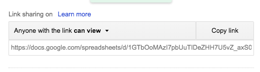
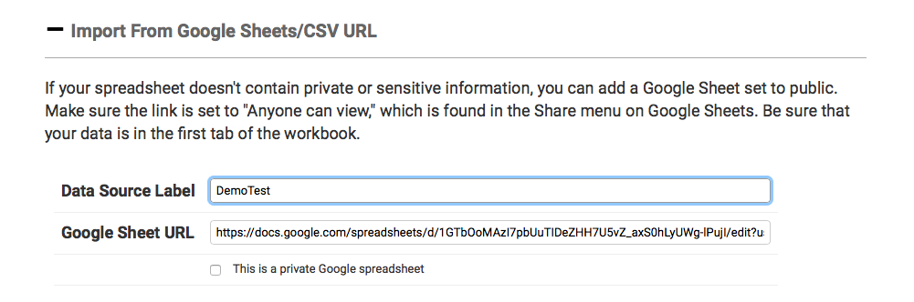

# Using a Public Google Spreadsheet

If your spreadsheet doesn’t contain private or sensitive information, you can set it to be publicly viewable. Make sure the link is set to "Anyone with the link can view," which is found in the “Share” menu in Google Sheets. Important: Be sure that your data is in the first tab of the workbook.

Next, you'll need to copy the spreadsheet's URL from the address bar in your browser. Give your project a name in the "Data Source Label" field, and paste in the URL you copied from your spreadsheet.

