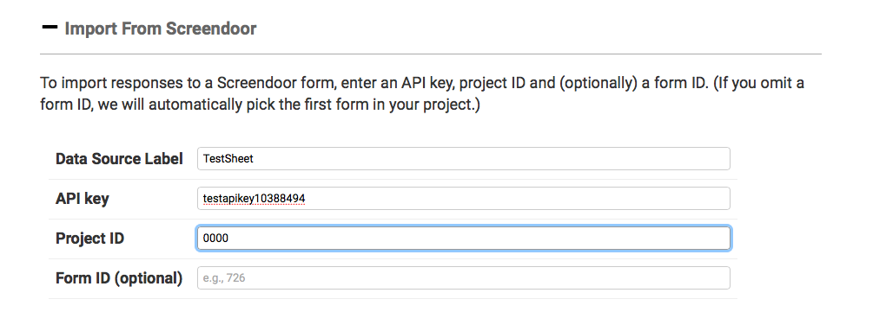

# Using Screendoor

First, you'll need to find the project ID for your form. You'll find that in Screendoor in your project under Settings &gt; General Settings &gt; Advanced Settings.

Next, you'll need to produce an API key. Ask your Screendoor administrator; it should be a string of letters and numbers.

Input the project ID and give your project a name and paste in the two fields.

