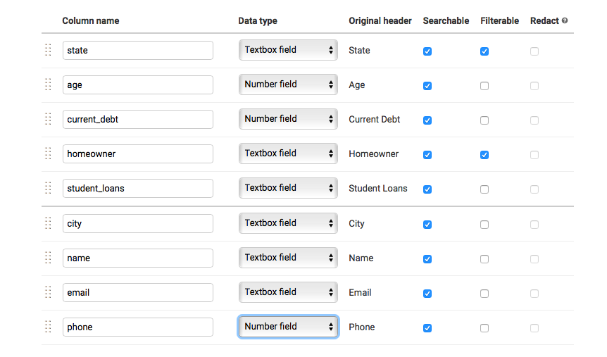
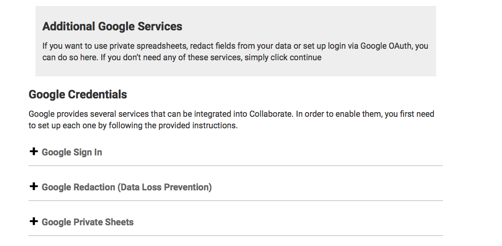
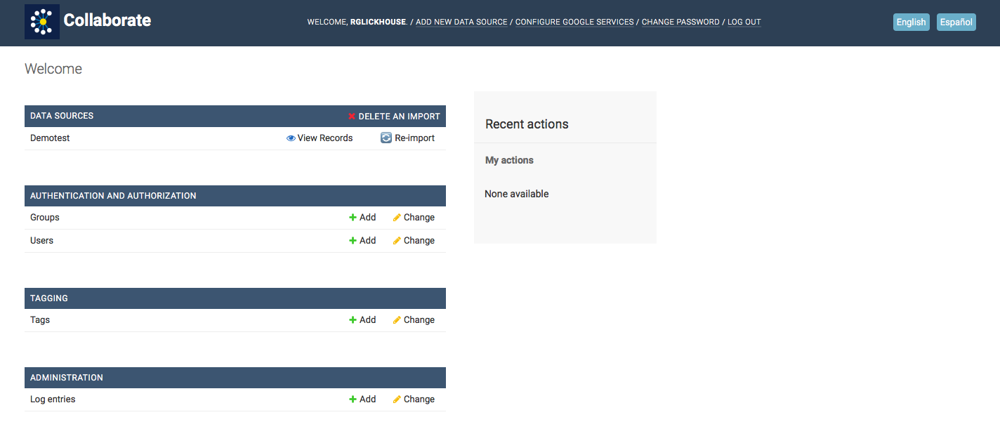

# Organizing Your Data

Once you upload the data, you'll see the import screen.

Here, you can refine the columns by the type of data they contain, such as numbers or dates.

You can also choose the order in which the columns appear in the user interface. The first five columns will appear on your main screen, so you can drag and drop the most important columns in the top five slots.

Finally, you can choose which columns are searchable and filterable. You'll most likely want to make everything searchable. Filters let you show only the entries that have one of a limited set of multiple-choice answers. Important: Don’t make a field that allows free-form text or more than 20 possible answers filterable.

Note: Your choices here are important but not unalterable. If you want to change the column order or these preferences later, you can refresh the data by hitting the “Re-Import” button on the top right of Collaborate’s main screen.

You can also choose to redact personal information from specific columns. You'll have to go through a separate process for that. \(See the section below titled “Redacting Data With Cloud Data Loss Prevention.”\)

## Adding Other Google Services

After you upload data for the first time, you'll get the option to set up additional Google services, including the setup processes for private sheets, for Google Sign-In and for using Google’s cloud service to redact names and other personal information.

You can also opt to set these up later by clicking “Continue.”

## Completing the Setup Process

Once your data has been successfully uploaded, you'll be taken to your main screen, and you can access your project under “Data Sources.”

## 

