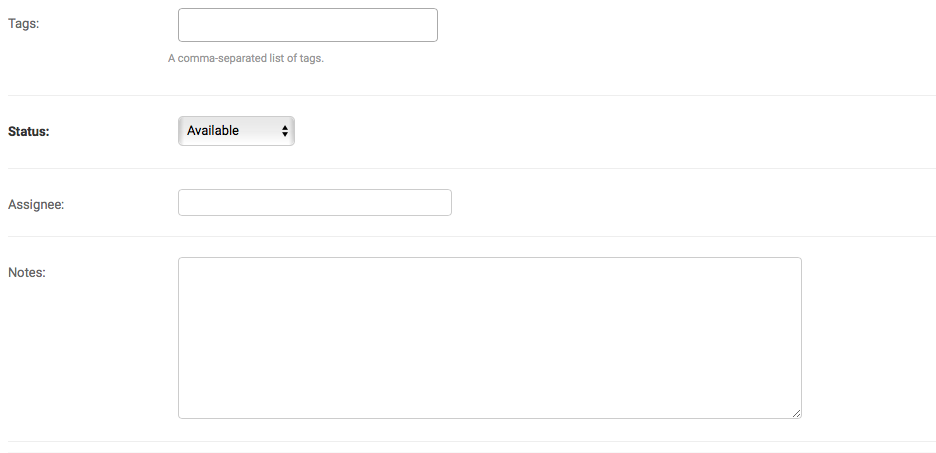

# Adding Metadata

Collaborate is meant to make it easier to coordinate on large datasets. The metadata fields added by Collaborate allow you to leave notes on each entry, keep track of which journalist is working on which data point, set the status of each data point and create a log of contacts on each data point.

Important: Any time you update the metadata, don't forget to scroll down to the bottom of the page and hit “Save.”

