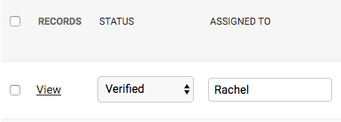
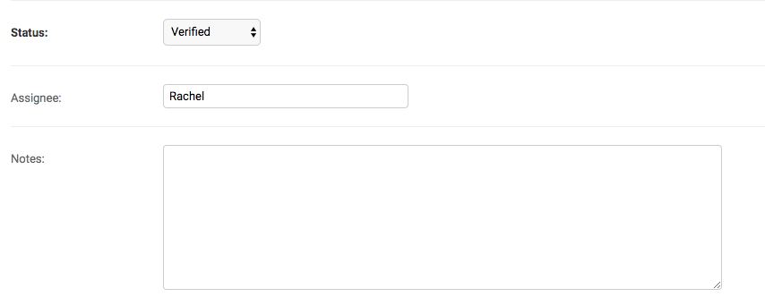

# Assigned-to

This helps you track which reporter is working on each data point. You can add these in the list view or while you're in an individual data point.

If you're in an individual data point, be sure to hit “Save” after you make updates.

Each assignee name added will appear in the “Filters” column in the list view so that you can track who is working on which data points.

