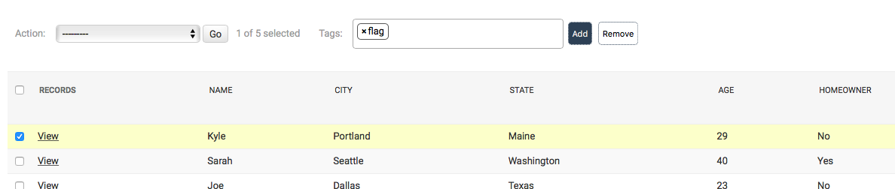
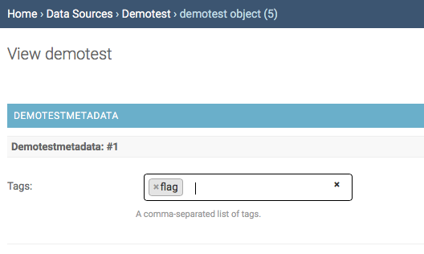
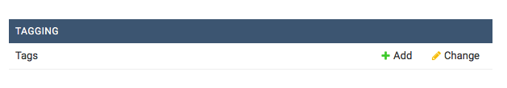
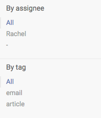

# Creating Tags

In order to organize your data into groups, you can create tags. There are two ways to do this.

On your list view page, you can type in a new or existing tag in the “Tags” box. Select the data points you want to add the tag to using the check boxes and click “Add.” You can do the same to remove them — that is, clicking the “Remove” button. You can also remove tags in list view by clicking the small “X” next to the tag name in the “Tags” column.

You can also add tags in the individual data point. Open an individual data point, and you can type in a tag in the “Tags” field to create a new one or to bring up an existing tag. Tags will also appear as filters on your main screen.

If you need to update or delete a tag, go to the main screen and click on “Tags” under the “Tagging” line. Click on an individual tag to edit it.

You can also filter by tags on the main screen.

