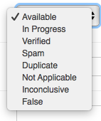

# Status

Status is a field that helps you keep track of what's going on with each tip or data point. You can update this in the list view by selecting the dropdown, or in an individual data point by using the dropdown, scrolling to the bottom of the page and hitting “Save.”

You can filter by the status of all the tips in the list view in the right-hand column.

