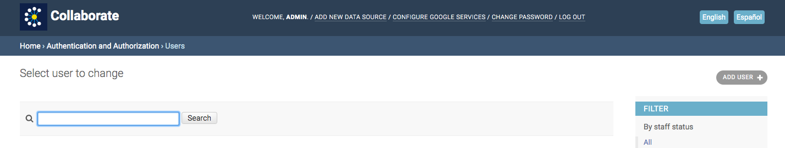

# Adding Users to Projects

You can restrict users' access to specific projects. If you want to give the person access to a specific project, click on “Users” under “Authentication and Authorization.” Select the user you want to edit. Scroll down to “Groups.” Click on the project you want to add, and click the right-hand arrow button. Repeat this for each project. When you're done, scroll to the bottom and click “Save.”

If you have other administrators, you can give them access to everything. You can give them superuser status by checking the superuser status box. Scroll to the bottom and click “Save.”

