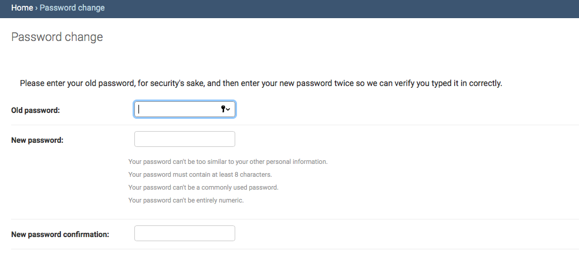

# Changing Your Password

To change your password, navigate to the main screen. At the top of the page, you'll see "Change Your Password" next to “View Site.” Make sure to hit “Save” after you change your password.

