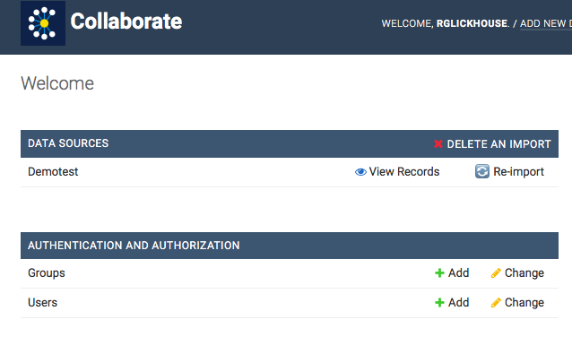
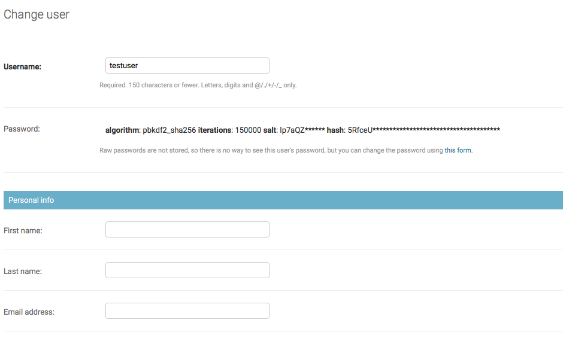

# Creating Users

You can add multiple users to a dataset. On your main screen, go to Users &gt; Add User under “Authentication and Authorization.” Create a username and enter the user's email address. Enter a temporary password; the person will be asked to change the password when they log in.

Important: Remember to make the password secure even though it’s temporary, and transmit the password to the user securely.

Once you have created the new user, you'll be asked to provide more information about them and to give them access permission.

