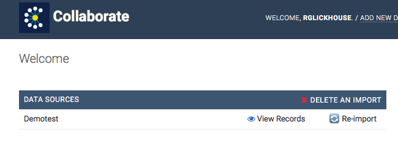

# Deleting a Project or Entry

To delete a project from Collaborate, navigate to your main screen. In the Data Sources section, click “Delete an Import.” Select the project or projects by clicking the checkboxes. Then click the “Action” box, select “Delete Selected Successful Imports” and click “Go.” A new screen that will appear that says “Are you sure?” Click “Yes, I'm sure.”

To delete a single record, open up the entry. Scroll to the bottom, and click “Delete.” You'll arrive at a screen that says “Are you sure?” Click “Yes, I'm sure.”

