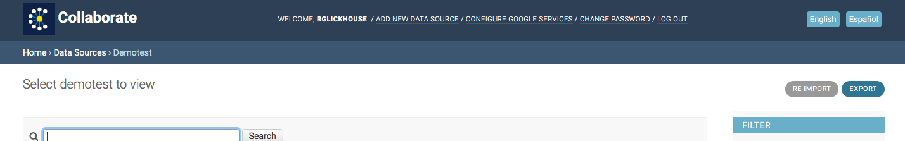

# Exporting Your Data

You can export your data as a spreadsheet. On the top right corner of the page, click the “Export” button. Choose the file format you'd like from the dropdown. Then click “Submit.”

