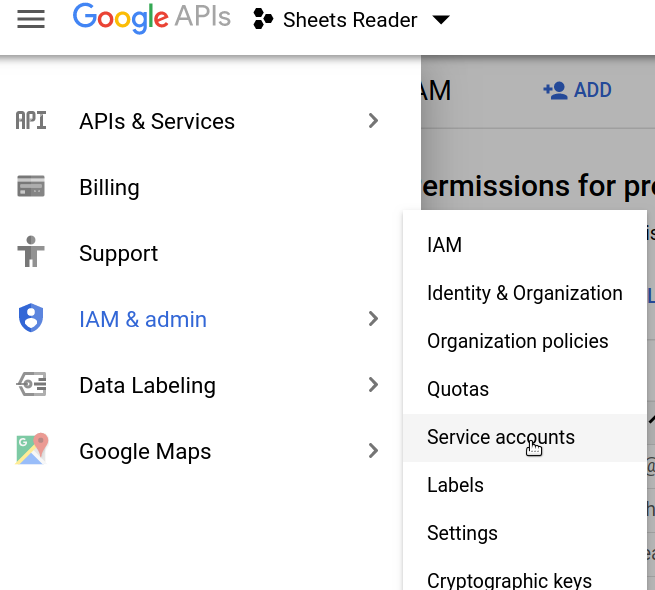
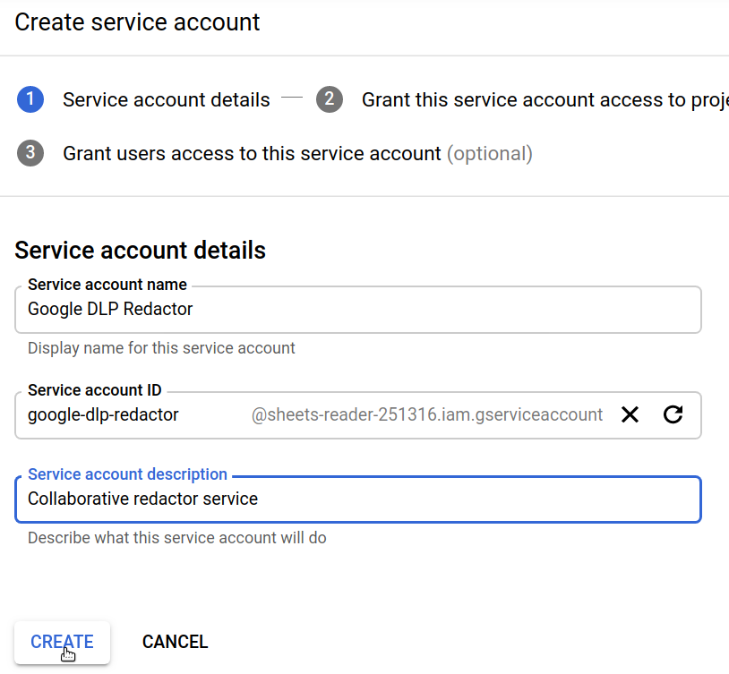
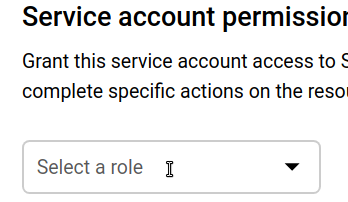
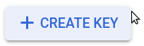
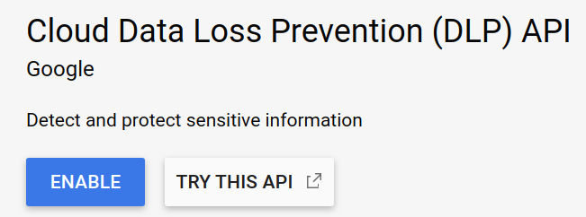
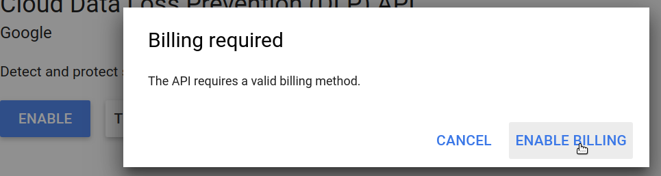

# Redacting Data With Cloud Data Loss Prevention

To have the app automatically redact personally identifiable information \(names, phone numbers, email addresses, etc.\) upon import from a spreadsheet, you can use the Google Data Loss Prevention, or DLP, service. In order to use this service, you need to create a DLP credentials file and set up a billing account with Google by following the instructions below. Please keep in mind that Google has a [free tier](https://cloud.google.com/dlp/pricing) and that you can use your free credits toward the service.

Note: This will not remove the information from the source data \(e.g., your original Google Sheet\). This will only prevent it from being saved to Collaborate's database and shown to your users.

#### Credentials Instructions

1. Go to the [Google Developer's Console](https://console.developers.google.com/).
2. Create a new project or select an existing one \(if you've already set up Google private sheets, for example\).
3. From the dropdown menu on the top left, select "IAM & admin" &gt; "Service accounts."

4. Click "Create Service Account" at the top of the service accounts page.

  

5. Name your new Google Redactor service account.

6. Open the "Select a role" menu, search for "DLP User" and select that role to grant your account access to the redactor service.

  
7. Select "Create Key" and, in the right tab that opens, select a JSON key and click "Create." Save the credentials file it gives you. Finally, click the "Done" button below the newly created keys list.

  
8. Go to the [Google Cloud API screen for Google DLP](https://console.cloud.google.com/apis/library/dlp.googleapis.com). Click "Enable.” Cloud DLP requires you to set up a billing account with Google. If you haven't done this, you will be asked to go through the account wizard. At the end, you will be directed back to this screen, where you can click "Enable" again. 

  
9. Once you have those credentials, upload them to Collaborate by clicking on "Configure Google Services" on the main screen. Click on "Google Redaction \(Data Loss Prevention\)." Scroll down to "Credentials file," upload the file and click "Continue." You are now ready to select fields for redaction by clicking the “Redact” checkbox on the Import and Refine screen.

You can see [Google’s documentation for getting credentials](https://cloud.google.com/dlp/docs/auth) for more technical details.

