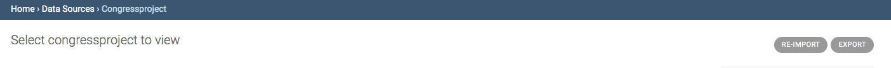

# Updating Your Data

If you receive new responses to your crowdsourcing form in Google Forms or Screendoor, or if you enter new records into your Google Sheet, that information will automatically update in Collaborate. The system is set to refresh every 15 minutes. If you'd like to force a refresh, just click the “Re-import” button.

